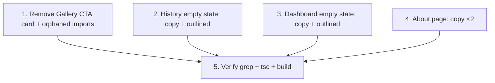

# Implementation Plan

## Overview

Pure copy + visual-prominence cleanup of repetitive generation CTAs, per the audit. Five independent file edits (no inter-dependencies) plus a verification pass. No logic, no new components, no routing/backend changes; canonical and contextual CTAs are left untouched.

## Task Dependency Graph



```json
{
  "waves": [
    { "wave": 1, "tasks": ["1", "2", "3", "4"] },
    { "wave": 2, "tasks": ["5"] }
  ]
}
```

Wave 1: the four independent edits (different files, no ordering). Wave 2: verification. `components/ui/empty-state.tsx` is out of scope (D4) and has no task.

## Tasks

- [ ] 1. Remove the redundant Gallery CTA card (`app/(user)/gallery/page.tsx`)
  - Delete the entire `{/* Inline CTA card */}` block (the white bordered card with "Can't find what you're looking for?" and the "Generate from Scratch" `Link`).
  - Remove the now-unused `Link` import (`import Link from "next/link"`) and the `ArrowRight` entry from the `lucide-react` import (both are used only inside that card — verified).
  - Leave the grid, pagination, `TemplateDetailModal`, and toast container untouched.
  - _Requirements: 2.1, 2.2, 5.4_
  - _Properties: 2_

- [ ] 2. History empty state — vary copy + downgrade (`app/(user)/history/page.tsx`)
  - In the main design empty state (the `history.length === 0` branch), change the button text "Start Generating" → "Generate your first design".
  - Change its className from filled (`bg-[#F97316] text-white ... hover:bg-[#F97316]/90`) to outlined: `px-6 py-3 border-2 border-[#F97316] text-[#F97316] bg-white rounded-xl font-semibold hover:bg-[#F97316]/5 transition-all`.
  - Keep the `onClick={() => router.push("/generate")}` behavior and the heading/description unchanged.
  - _Requirements: 3.1, 4.1, 5.1_
  - _Properties: 3, 4, 5_

- [ ] 3. Dashboard empty state — vary copy + downgrade (`app/(user)/dashboard/page.tsx`)
  - In the recent-designs empty state (`recentDesigns.length === 0` branch), change "Start Generating" → "Generate your first design".
  - Apply the same outlined style as Task 2 (`border-2 border-[#F97316] text-[#F97316] bg-white hover:bg-[#F97316]/5`), replacing the filled-amber classes.
  - Keep the `router.push("/generate")` behavior and surrounding markup unchanged.
  - _Requirements: 3.2, 4.2, 5.1_
  - _Properties: 3, 4, 5_

- [ ] 4. About page — vary copy (`app/about/page.tsx`)
  - Change both "Start Generating" anchor labels (hero secondary link ~L128 and closing CTA ~L589) to "Generate your first design".
  - Copy only — leave both anchors' existing styles and `href="/generate"` unchanged (D3).
  - _Requirements: 3.4, 5.1_
  - _Properties: 3, 5_

- [ ] 5. Verify copy, build, and scope
  - Grep shipped code (`app/`, excluding `z/` and `.kiro/`) for `"Start Generating"` and `"Generate from Scratch"` — expect zero matches. (`components/ui/empty-state.tsx` may still contain "Start Generating" — that's intentional per D4 and is out of scope.)
  - Run `getDiagnostics` on the 4 edited files, then `npx tsc --noEmit` and `npm run build`; fix any errors (notably the orphaned-import risk from Task 1).
  - Confirm canonical/contextual CTAs (nav, Generate button + header, Use This Template, Browse Gallery), footer links, and informational text are unchanged.
  - _Requirements: 1.1, 1.2, 1.3, 1.4, 5.2, 5.4, 5.5_
  - _Properties: 1, 2, 3, 4, 5_

## Notes

- **Pure copy/visual.** No logic, no new components, no prop-interface or routing/backend changes. Every changed CTA keeps its existing navigation target.
- **Keep list (do not touch):** top-nav "Generate" tab; Generate page primary button + header; "Use This Template" (`TemplateDetailModal`); "Browse Gallery" (favorites empty state); footer "Generate Design" link; informational muted text ("Generate designs to see your most used type", etc.).
- **About (D3):** copy-only, no style downgrade — these are public landing CTAs, not in-app empty states.
- **EmptyHistory (D4):** `components/ui/empty-state.tsx` is OUT OF SCOPE — dead/unused code, left untouched, noted as known dead code for future cleanup.
- **In-scope files (exhaustive):** `app/(user)/gallery/page.tsx`, `app/(user)/history/page.tsx`, `app/(user)/dashboard/page.tsx`, `app/about/page.tsx`.
- No test runner is configured; the grep check + `npx tsc --noEmit` + `npm run build` are the gates.
