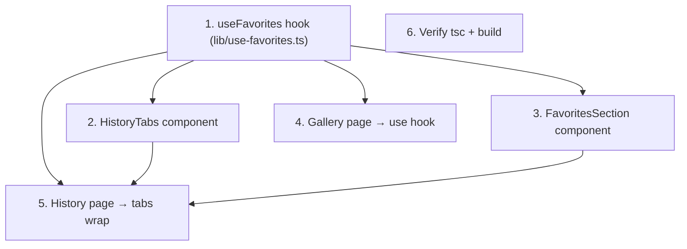

# Implementation Plan

## Overview

Frontend-only feature. Tasks proceed bottom-up: the persistence hook first (everything depends on it), then the two History tab components in parallel, then the two page integrations, then verification. No backend, `/api/`, server action, or backend-coupled hook may be touched; `TemplateCard` and the Generations content are reused unchanged.

## Task Dependency Graph



```json
{
  "waves": [
    { "wave": 1, "tasks": ["1"] },
    { "wave": 2, "tasks": ["2", "3", "4"] },
    { "wave": 3, "tasks": ["5"] },
    { "wave": 4, "tasks": ["6"] }
  ]
}
```

Wave 1: Task 1 (hook). Wave 2: Tasks 2–4 (tabs, favorites section, gallery swap — all depend only on the hook). Wave 3: Task 5 (history page wires tabs + section). Wave 4: Task 6 (verify).

## Tasks

- [ ] 1. Create the `useFavorites` hook (`lib/use-favorites.ts`)
  - Export `FAVORITES_STORAGE_KEY = "kemas-favorite-templates"` and `useFavorites()` returning `{ favoriteIds: Set<string>, isFavorite, toggleFavorite, count }`.
  - Initialize state as an empty `Set` (SSR-safe; no `localStorage` during render). On mount, hydrate from `localStorage[FAVORITES_STORAGE_KEY]` via JSON parse inside try/catch, validating it is a string array; fall back to empty set on any error.
  - Persist `JSON.stringify([...set])` to `localStorage` whenever the set changes, gated behind a `hydrated` flag so the initial empty set never clobbers stored data before hydration.
  - Add a `window` `storage` event listener that re-parses `e.newValue` into the set when `e.key === FAVORITES_STORAGE_KEY` (try/catch guarded); remove it on unmount.
  - `toggleFavorite` clones the set (add/remove); `isFavorite(id)` = `has(id)`; `count` = `size`. Guard all `window`/`localStorage` access with `typeof window !== "undefined"`.
  - _Requirements: 1.1, 1.2, 1.3, 1.4, 1.5, 1.6, 2.1, 2.2, 2.3_
  - _Properties: 1, 2, 3, 4, 7_

- [ ] 2. Create the `HistoryTabs` switcher (`components/history/history-tabs.tsx`)
  - Export a `HistoryTab` type (`"generations" | "favorites"`) and a default component with props `active`, `onChange`, `favoritesCount`.
  - Render two tab buttons in a row with a bottom border; active = `text-[#F97316]` + `border-b-2 border-[#F97316]`, inactive = `text-[#737373]` no underline; `transition-all duration-300 ease-out`.
  - Show "Favorites ({count})" when `favoritesCount > 0`, else "Favorites".
  - _Requirements: 3.1, 3.3, 3.4_

- [ ] 3. Create the `FavoritesSection` (`components/history/favorites-section.tsx`)
  - Call `useFavorites()`; derive `favorites = GALLERY_TEMPLATES.filter(t => favoriteIds.has(t.id))` (memoized).
  - Render a grid `grid-cols-1 md:grid-cols-2 lg:grid-cols-4 gap-[14px]` of `<TemplateCard template isFavorite={true} onToggleFavorite={toggleFavorite} />` (reused unchanged).
  - When `count === 0`, render the centered empty state: lucide `Heart`, "No favorites yet", subtext "Browse the gallery to save templates you like.", and an amber "Browse Gallery" button using `Link href="/gallery"`.
  - _Requirements: 4.1, 4.2, 4.3, 4.4, 5.1, 5.2, 5.3, 6.1, 6.2_
  - _Properties: 5, 6_

- [ ] 4. Switch the Gallery page to the hook (`app/(user)/gallery/page.tsx`)
  - Replace `const [favoriteIds, setFavoriteIds] = useState<Set<string>>(new Set())` and the local `toggleFavorite` with `const { isFavorite, toggleFavorite } = useFavorites()`.
  - Pass `isFavorite={isFavorite(template.id)}` and `onToggleFavorite={toggleFavorite}` to `TemplateCard`. Remove the now-unused `useState` import only if nothing else uses it. No other gallery behavior changes.
  - _Requirements: 7.1, 7.2, 7.3, 8.3_
  - _Properties: 1, 2_

- [ ] 5. Wrap the History page in tabs (`app/(user)/history/page.tsx`)
  - Add `const [activeTab, setActiveTab] = useState<HistoryTab>("generations")` and `const { count } = useFavorites()`.
  - Insert `<HistoryTabs active={activeTab} onChange={setActiveTab} favoritesCount={count} />` directly below the title/description block.
  - Gate the existing stat cards + filter bar + main `grid lg:grid-cols-12` (generations grid + sidebar) under `activeTab === "generations"` — same markup, conditionally rendered. Render `<FavoritesSection />` under `activeTab === "favorites"`.
  - Do not change the Generations data fetching, filters, sidebar, or card markup.
  - _Requirements: 3.1, 3.2, 3.5, 8.4_
  - _Properties: 7_

- [ ] 6. Verify typecheck, build, and scope
  - Run `getDiagnostics` on the 4–5 in-scope files, then `npx tsc --noEmit` and `npm run build`; fix any type/import errors.
  - Confirm no `/api/`, server action, or backend-coupled hook was touched, `TemplateCard` is unchanged, and the Generations content/markup is intact.
  - Spot-check: favoriting in Gallery persists across refresh; Favorites tab shows hearted templates; unfavoriting removes a card; empty state + "Browse Gallery" link; tab active styling + count badge; SSR (no hydration warning in build).
  - _Requirements: 8.1, 8.2, 8.3, 8.4, 8.5_
  - _Properties: 1, 2, 3, 4, 5, 6, 7_

## Notes

- **Backend hard out-of-scope.** No task may modify anything under `app/api/`, route handlers, server actions, or backend-coupled hooks (`useGallery`, `useCredits`). Persistence is `localStorage` only.
- **`TemplateCard` is reused as-is** — no prop or render changes.
- **Generations content preserved** — only wrapped in a conditionally rendered tab; markup and behavior unchanged.
- **`history-tabs.tsx`** is optional but recommended for clarity; if skipped, the tab UI lives inline in the History page (still satisfies the requirements).
- **In-scope files (exhaustive):** create `lib/use-favorites.ts`, `components/history/favorites-section.tsx`, optionally `components/history/history-tabs.tsx`; update `app/(user)/gallery/page.tsx`, `app/(user)/history/page.tsx`.
- No test runner is configured; `npx tsc --noEmit` + `npm run build` are the minimum gates. Use the approved palette and lucide `Heart` (non-AI icon).
