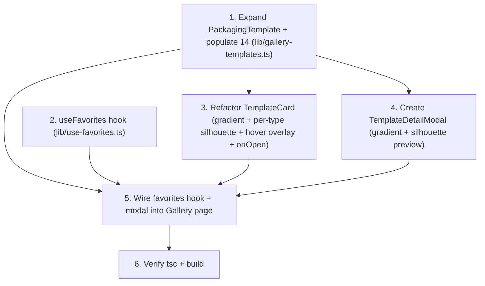

# Implementation Plan

## Overview

Frontend-only Gallery card redesign with persistent favorites — using the existing gradient + per-type silhouette preview (no images). Tasks proceed: data and the favorites hook first (independent foundations), then the card refactor and the new modal, then the page wiring (favorites hook + modal), then verification. No backend, `/api/`, or server actions; no `next/image` or `next.config.ts` change; the History page, Generate flow, the shared packaging-icons file, and the packaging-type selector are all untouched.

## Task Dependency Graph



```json
{
  "waves": [
    { "wave": 1, "tasks": ["1", "2"] },
    { "wave": 2, "tasks": ["3", "4"] },
    { "wave": 3, "tasks": ["5"] },
    { "wave": 4, "tasks": ["6"] }
  ]
}
```

Wave 1: data + favorites hook (independent). Wave 2: card refactor + modal (depend on data). Wave 3: page wiring (favorites hook + modal). Wave 4: verify.

## Tasks

- [ ] 1. Expand the template type and data (`lib/gallery-templates.ts`)
  - Update `PackagingTemplate`: add `styleTags: string[]`, `description: string`, `colorPalette: string[]`; **keep** `gradientFrom`/`gradientTo` and `createdAt`. Do NOT add `imageUrl` or `fallbackGradient`.
  - For all 14 entries: add 2–3 mood `styleTags`, a 2–3 sentence `description`, and 4–6 `colorPalette` hex values. Preserve existing `id`/`name`/`packagingType`/`badge`/`usageCount`/`gradientFrom`/`gradientTo`/`createdAt`.
  - Keep the file header comment describing the gradient + metadata shape (no image/TODO note needed).
  - _Requirements: 4.1, 4.2, 4.3, 4.4, 4.5, 4.6_
  - _Properties: 5_

- [ ] 2. Create the `useFavorites` hook (`lib/use-favorites.ts`)
  - Export `FAVORITES_STORAGE_KEY = "kemas-favorite-templates"` and `useFavorites()` returning `{ favoriteIds: Set<string>, isFavorite, toggleFavorite, count }`.
  - Initialize state as an empty `Set` (SSR-safe; no `localStorage` during render). On mount, hydrate from `localStorage[FAVORITES_STORAGE_KEY]` via JSON parse inside try/catch, validating it is a string array; fall back to empty set on any error.
  - Persist `JSON.stringify([...set])` whenever the set changes, gated behind a `hydrated` ref so the initial empty set never clobbers stored data before hydration.
  - Add a `window` `storage` listener that re-parses `e.newValue` into the set when `e.key === FAVORITES_STORAGE_KEY` (try/catch guarded); remove it on unmount. Guard all `window`/`localStorage` access with `typeof window !== "undefined"`.
  - `toggleFavorite` clones the set (add/remove); `isFavorite(id)` = `has(id)`; `count` = `size`.
  - _Requirements: 9.1, 9.2, 9.3, 9.4, 9.5, 9.6, 9.7_
  - _Properties: 8, 9, 10_

- [ ] 3. Refactor `TemplateCard` (`components/gallery/template-card.tsx`)
  - Add an `onOpen: (template) => void` prop; root becomes `group relative ... cursor-pointer transition-all duration-300 ease-out hover:-translate-y-1 hover:shadow-lg` with `onClick={() => onOpen(template)}`, `role="button"`, `tabIndex={0}`, and Enter/Space key handling.
  - Keep the gradient preview (`aspect-[4/5]` with inline `backgroundImage: linear-gradient(to bottom right, gradientFrom, gradientTo)`); render the per-`packagingType` silhouette from `components/icons/packaging-icons.tsx` (e.g. `PACKAGING_ICONS[template.packagingType]`) centered, `text-white`, `strokeWidth={2}`, sized ~55–60% of preview height (e.g. `h-[58%] w-auto`). No `next/image`, no image load/error logic.
  - Keep the heart (top-right, always visible, `stopPropagation` then `onToggleFavorite`) and POPULAR/NEW badge (top-left). Remove the footer block below the preview.
  - Add the bottom hover overlay: absolute, full-width, `bg-gradient-to-t from-black/80 via-black/40 to-transparent`, `p-3`; hidden by default (`translate-y-full opacity-0`) → shown on `group-hover` (`translate-y-0 opacity-100`) with `transition-all duration-300 ease-out`; contains the name (`text-white font-medium text-[13px]`) and frosted style-tag pills (`bg-white/15 backdrop-blur-sm text-white border border-white/20 px-2 py-0.5 rounded-full text-[10px]`).
  - _Requirements: 1.1, 1.2, 1.3, 1.4, 2.1, 2.2, 2.3, 2.4, 2.5, 3.5, 7.2_
  - _Properties: 1, 4, 6_

- [ ] 4. Create `TemplateDetailModal` (`components/gallery/template-detail-modal.tsx`)
  - Props `{ template: PackagingTemplate | null; onClose: () => void }`; return `null` when `template` is null.
  - Backdrop `fixed inset-0 z-50 bg-black/60 backdrop-blur-sm` fade-in with `onClick={onClose}`; centered container `max-w-[900px] w-full max-h-[85vh] bg-white rounded-2xl overflow-hidden` scale-in, `onClick` stops propagation. Two columns (stack on mobile): left ~60% gradient + large centered silhouette preview; right ~40% `p-6` scrollable.
  - Right column: close (X) top-right neutral hover; name (`text-[22px] font-bold`); packaging-type pill (`packagingTypeLabel`); "Description" (description); "Styles" as amber-bordered pills; "Colors" as 4–6 `w-7 h-7 rounded-full` swatches via inline `backgroundColor`; full-width amber "Use This Template" + `ArrowRight` as `Link href="/generate"`.
  - Effects (only while open): scroll lock (`document.body.style.overflow="hidden"` on mount, restore on cleanup) and an Escape `keydown` listener calling `onClose` (removed on cleanup). Use a mount-triggered state + Tailwind `transition-*` for the entrance (no `tailwindcss-animate` plugin available).
  - _Requirements: 3.3, 3.4, 3.6, 5.1, 5.2, 5.3, 5.4, 5.5, 6.1, 6.2, 6.3, 6.4, 6.5, 7.2_
  - _Properties: 2, 3, 7_

- [ ] 5. Wire the favorites hook + modal into the Gallery page (`app/(user)/gallery/page.tsx`)
  - Replace the local favorites state — remove `const [favoriteIds, setFavoriteIds] = useState<Set<string>>(new Set())` and the local `toggleFavorite` — with `const { isFavorite, toggleFavorite } = useFavorites()`. Pass `isFavorite={isFavorite(template.id)}` and `onToggleFavorite={toggleFavorite}` to each `TemplateCard`.
  - Add `const [selectedTemplate, setSelectedTemplate] = useState<PackagingTemplate | null>(null)`; pass `onOpen={setSelectedTemplate}` to each `TemplateCard`; render `<TemplateDetailModal template={selectedTemplate} onClose={() => setSelectedTemplate(null)} />` after the grid.
  - Leave search/filter/sort/paginate and all other markup unchanged.
  - _Requirements: 3.1, 3.2, 8.5, 9.8_
  - _Properties: 1, 2, 8_

- [ ] 6. Verify typecheck, build, and scope
  - Run `getDiagnostics` on the 5 in-scope files, then `npx tsc --noEmit` and `npm run build`; fix any errors.
  - Confirm no `/api/`, server action, History page, `components/history/*`, `next.config.ts`, `packaging-icons.tsx`, `packaging-type-selector.tsx`, or Generate page change; data stays hardcoded; no `next/image` introduced.
  - Spot-check: non-hover shows gradient + correct per-type silhouette; hover reveals overlay + lift; heart toggles without opening modal; favoriting persists across refresh; card click opens modal; X/backdrop/Escape close it; scroll lock engages/releases; modal shows correct preview/name/type/description/tags/colors; "Use This Template" → `/generate`.
  - _Requirements: 7.1, 7.2, 8.1, 8.2, 8.3, 8.4, 8.6, 8.7_
  - _Properties: 1, 2, 3, 4, 5, 6, 7, 8, 9, 10_

## Notes

- **Backend hard out-of-scope.** No task may touch `app/api/`, route handlers, or server actions; data stays hardcoded; "Use This Template" only links to `/generate`.
- **No images.** Previews are CSS gradients + inline SVG silhouettes — no `next/image`, no `picsum.photos`, no `next.config.ts` change.
- **Shared icons already exist.** `components/icons/packaging-icons.tsx` and `packaging-type-selector.tsx` were created/wired by a prior PR; this PR only consumes the icons and does NOT modify either file.
- **History out of scope.** No task may modify `app/(user)/history/page.tsx` or create `components/history/*`; the History Favorites tab is a separate, deferred PR.
- **Favorites are persistent.** This PR builds `lib/use-favorites.ts` (localStorage + cross-tab sync, SSR-safe); the Gallery consumes it. `TemplateCard`'s heart props are preserved (an `onOpen` prop is added).
- **`createdAt` retained** so the existing "Newest" sort keeps working.
- **In-scope files (exhaustive):** create `lib/use-favorites.ts`, `components/gallery/template-detail-modal.tsx`; update `lib/gallery-templates.ts`, `components/gallery/template-card.tsx`, `app/(user)/gallery/page.tsx`.
- No test runner is configured; `npx tsc --noEmit` + `npm run build` are the minimum gates. Black overlays/backdrops are decorative and permitted; other UI chrome uses approved tokens.
