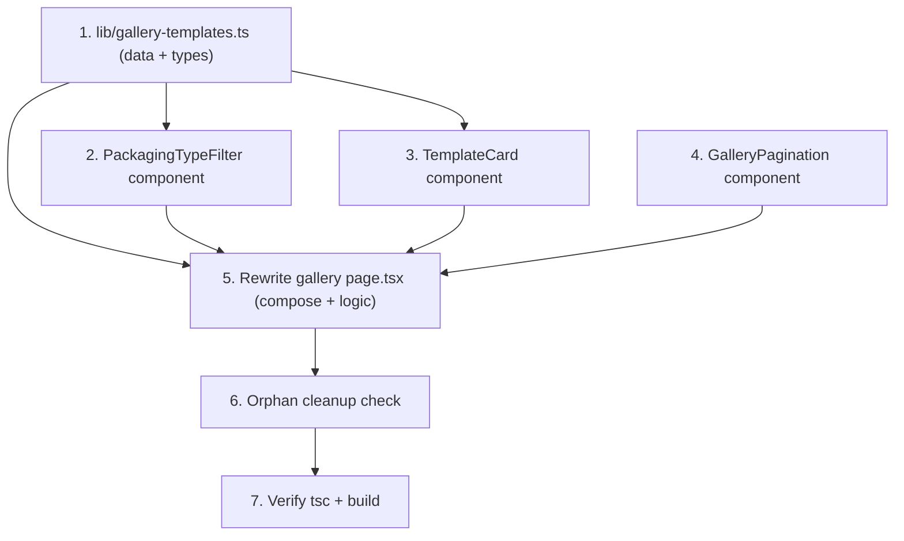

# Implementation Plan

## Overview

Frontend-only Gallery redesign. Tasks proceed bottom-up: the local dataset first (everything depends on its types), then the three presentational components, then the page composition that wires them together with filter/sort/paginate/favorites logic, then orphan cleanup, then verification. No backend, `/api/`, server action, or auth/credit hook may be touched by any task.

## Task Dependency Graph



```json
{
  "waves": [
    { "wave": 1, "tasks": ["1"] },
    { "wave": 2, "tasks": ["2", "3", "4"] },
    { "wave": 3, "tasks": ["5"] },
    { "wave": 4, "tasks": ["6"] },
    { "wave": 5, "tasks": ["7"] }
  ]
}
```

Wave 1: Task 1 (data/types, no deps). Wave 2: Tasks 2–4 (components, depend only on the data types). Wave 3: Task 5 (page, depends on data + all components). Wave 4: Task 6 (cleanup). Wave 5: Task 7 (verify).

## Tasks

- [ ] 1. Create the template dataset in `lib/gallery-templates.ts`
  - Export `GalleryPackagingType` (`"standing-pouch" | "pillow-pouch" | "box" | "jar" | "bottle" | "sachet"`), `TemplateBadge` (`"popular" | "new"`), and the `PackagingTemplate` interface (`id`, `name`, `packagingType`, optional `badge`, `usageCount`, `gradientFrom`, `gradientTo`, `createdAt`).
  - Export `GALLERY_TEMPLATES` with 14 snack entries (Keripik Singkong Premium, Rempeyek Heritage, Kerupuk Pedas Bold, Kue Kering Lebaran, Kacang Garing Snack, Kerupuk Udang Klasik, Oleh-Oleh Premium Box, Pisang Sale Tradisional, Dodol Tradisional, Bakpia Klasik, Sambal Roa Sachet, Manisan Mangga, plus 2 more snack names), each with a packaging type, optional badge (mix of `popular`/`new`/none), `usageCount` in 400–1500, mood-based `gradientFrom`/`gradientTo` from the approved tokens only, and a distinct ISO `createdAt`.
  - _Requirements: 8.1, 8.2, 8.3, 8.4, 8.5_

- [ ] 2. Create `PackagingTypeFilter` (`components/gallery/packaging-type-filter.tsx`)
  - Export `PACKAGING_TYPE_OPTIONS` (All Types=`all` default, plus the 6 types) and a `packagingTypeLabel(value)` helper for reuse by the card/page.
  - Render the uppercase "PACKAGING TYPE" label and pill chips; props `selected`, `onSelect`. Active chip: `bg-[#F97316] text-white`; inactive: white bg + neutral border + hover. Use `transition-all duration-300 ease-out`.
  - _Requirements: 3.1, 3.2, 3.5, 3.6, 10.1, 10.2_

- [ ] 3. Create `TemplateCard` (`components/gallery/template-card.tsx`)
  - Props `template`, `isFavorite`, `onToggleFavorite`. Root uses `group ... rounded-2xl overflow-hidden transition-all duration-300 ease-out hover:-translate-y-0.5 hover:shadow-md`.
  - Preview: `aspect-[4/5]` with inline `backgroundImage` linear-gradient from `gradientFrom`→`gradientTo`; centered enlarged lucide silhouette (`Package`/`Box`/`Container` by packaging type) in white.
  - Badge top-left: `popular` → white pill + `Zap` icon + "POPULAR" (amber text); `new` → solid amber pill + white "NEW". Heart button top-right: outline default, filled amber when favorite; `onClick` calls `onToggleFavorite(id)` with `stopPropagation`; add `aria-pressed`/`aria-label`.
  - Footer: name at 12px medium + metadata "{packagingTypeLabel} · {usageCount} uses".
  - _Requirements: 7.1, 7.2, 7.3, 7.4, 7.5, 10.1, 10.2, 10.3, 10.4_

- [ ] 4. Create `GalleryPagination` (`components/gallery/gallery-pagination.tsx`)
  - Props `currentPage`, `totalPages`, `onPageChange`. Centered row: `ChevronLeft`, numbered buttons `1..totalPages`, `ChevronRight`.
  - Current page: `bg-[#F97316] text-white`; others white + neutral border + hover. Disable chevrons at first/last page (`opacity-40 cursor-not-allowed`). Render nothing when `totalPages <= 1`. Use `transition-all duration-300 ease-out`.
  - _Requirements: 6.3, 6.5, 6.6, 10.1, 10.2_

- [ ] 5. Rewrite the Gallery page (`app/(user)/gallery/page.tsx`)
  - Replace the entire file: keep `AuthNavbar`; remove `useGallery()`, the Category filter, the Featured block, the preview modal, and the gradient CTA banner.
  - Import `GALLERY_TEMPLATES` and the three new components. Add state: `searchQuery` (""), `selectedPackagingType` ("all"), `sortBy` ("popular"), `currentPage` (1), `favoriteIds` (`Set<string>`), `sortMenuOpen` (false).
  - Inline hero (gradient icon + title + 2-line description), search row (full-width pill input with placeholder "Search templates by name, style, or color..." + decorative "Filters" pill that fires a "Coming soon" toast via `useToast`), `<PackagingTypeFilter />`, sort+count bar ("Showing X templates" with X = filtered length; "Sort by" dropdown: Most Popular/Newest/Most Used), the responsive grid (`grid-cols-1 md:grid-cols-2 lg:grid-cols-4`, `gap-[14px]`) mapping the page slice to `<TemplateCard />`, `<GalleryPagination />`, and the inline white CTA card with a `Link` to `/generate`.
  - Implement memoized filter → sort → paginate (PAGE_SIZE 12); reset `currentPage` to 1 when search/type/sort change; toggle favorites via a cloned `Set`. Render the empty state when the filtered list is empty.
  - _Requirements: 1.1, 1.2, 1.3, 2.1, 2.2, 2.3, 2.4, 3.3, 3.4, 4.1, 4.2, 5.1, 5.2, 5.3, 5.4, 6.1, 6.2, 6.4, 6.7, 9.1, 9.2, 10.1, 10.2, 11.2, 11.3_
  - _Properties: 1, 2, 3, 4, 5, 6, 7_

- [ ] 6. Confirm and remove orphaned gallery components
  - Search the workspace for any gallery component the redesign replaced; per current ground truth there are none (the old page was fully inline), so this is a verification step. Delete only files confirmed to have zero remaining importers. Do NOT delete `hooks/use-gallery.ts` (out of scope; left as a harmless no-op).
  - _Requirements: 11.4_

- [ ] 7. Verify typecheck, build, and scope
  - Run `getDiagnostics` on the 4 new/updated in-scope files, then `npx tsc --noEmit` and `npm run build`; fix any type/import errors.
  - Confirm no file under `app/api/`, no route handler, no server action, and no auth/credit hook was modified, and that the page no longer calls `useGallery()`.
  - Spot-check acceptance: defaults (all/popular/page 1), responsive grid + 14px gap, pagination bounds, favorite toggle isolation, "Showing X" = filtered length, CTA links to `/generate`, snack-only content, approved tokens only.
  - _Requirements: 11.1, 11.2, 11.3, 11.5_
  - _Properties: 1, 2, 3, 4, 5, 6, 7_

## Notes

- **Backend hard out-of-scope.** No task may modify anything under `app/api/`, route handlers, server actions, or auth/credit hooks; the page must not call `useGallery()` or fetch `/api/gallery`.
- **In-memory only.** Favorites and all UI state are per-session; no localStorage, no backend.
- **In-scope files (exhaustive):** create `lib/gallery-templates.ts`, `components/gallery/template-card.tsx`, `components/gallery/packaging-type-filter.tsx`, `components/gallery/gallery-pagination.tsx`; update `app/(user)/gallery/page.tsx`; delete only confirmed-orphan replaced gallery components (currently none).
- **`hooks/use-gallery.ts`** is intentionally left untouched (out of scope, still compiles); a future cleanup PR can remove it.
- No test runner is configured; `npx tsc --noEmit` + `npm run build` are the minimum gates per project rules. Use the approved palette and non-AI icons only.
