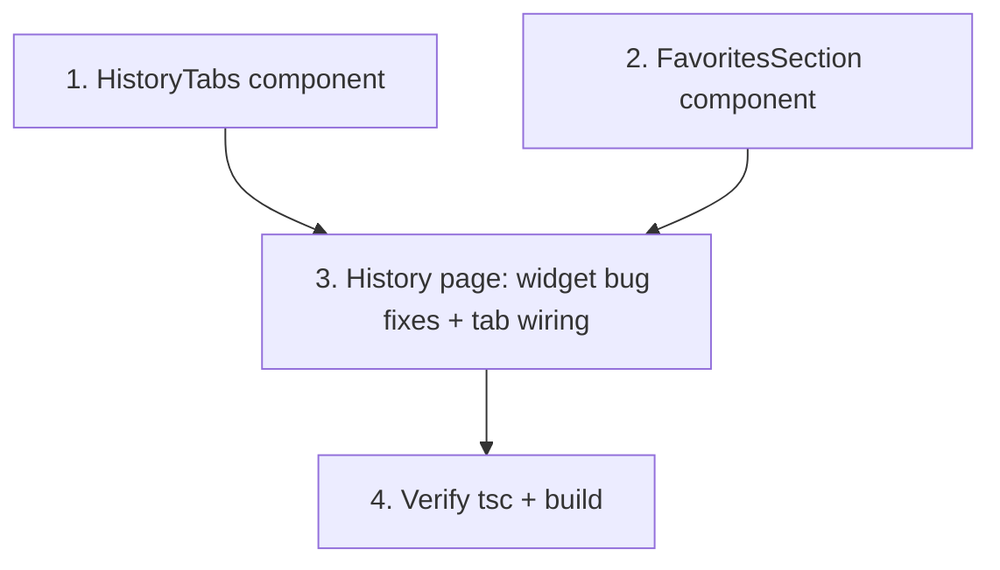

# Implementation Plan

## Overview

Frontend-only History page change: rendering-layer bug fixes plus a Favorites tab. Tasks proceed: the two new components first (they're self-contained), then the page integration that applies the widget fixes and wires the tabs/modal, then verification. No backend, `/api/`, data-hook, or Gallery changes; `TemplateCard`/`TemplateDetailModal`/`useFavorites`/`GALLERY_TEMPLATES` are consumed as-is.

## Task Dependency Graph



```json
{
  "waves": [
    { "wave": 1, "tasks": ["1", "2"] },
    { "wave": 2, "tasks": ["3"] },
    { "wave": 3, "tasks": ["4"] }
  ]
}
```

Wave 1: the two new components (independent). Wave 2: page integration (needs both). Wave 3: verify.

## Tasks

- [ ] 1. Create the `HistoryTabs` switcher (`components/history/history-tabs.tsx`)
  - Export `HistoryTab` type (`"generations" | "favorites"`) and a default component with props `active`, `onChange`, `favoritesCount`.
  - Two tab buttons over a `border-b border-[#E5E4E0]` container; active = `text-[#F97316]` + 2px amber underline; inactive = `text-[#737373]`, no underline; `transition-all duration-300 ease-out`.
  - Favorites label shows `Favorites ({favoritesCount})` when `> 0`, else `Favorites`.
  - _Requirements: 2.1, 2.3, 2.4_
  - _Properties: 8_

- [ ] 2. Create the `FavoritesSection` (`components/history/favorites-section.tsx`)
  - Props `{ onOpenTemplate: (template: PackagingTemplate) => void }`. Call `useFavorites()`; derive `favorites = GALLERY_TEMPLATES.filter(t => favoriteIds.has(t.id))` (memoized).
  - Render a grid `grid-cols-1 md:grid-cols-2 lg:grid-cols-4 gap-[14px]` of `<TemplateCard template isFavorite={true} onToggleFavorite={toggleFavorite} onOpen={onOpenTemplate} />` (reused unchanged).
  - When `count === 0`, render the centered empty state: lucide `Heart` (`w-12 h-12 text-[#A3A3A3]`), "No favorites yet", subtext "Browse the gallery to save templates you like.", amber "Browse Gallery" button via `Link href="/gallery"`.
  - _Requirements: 3.1, 3.2, 3.3, 3.5, 3.6_
  - _Properties: 5, 6_

- [ ] 3. Integrate tabs + apply widget bug fixes (`app/(user)/history/page.tsx`)
  - Add state: `activeTab` (`useState<HistoryTab>("generations")`), `selectedTemplate` (`useState<PackagingTemplate | null>(null)`), and `const { count } = useFavorites()`.
  - Insert `<HistoryTabs active={activeTab} onChange={setActiveTab} favoritesCount={count} />` below the header block.
  - Gate the existing filter bar + `grid lg:grid-cols-12` (design grid + sidebar) under `activeTab === "generations"`. Under `activeTab === "favorites"`, render `<FavoritesSection onOpenTemplate={setSelectedTemplate} />` full-width plus `<TemplateDetailModal template={selectedTemplate} onClose={() => setSelectedTemplate(null)} />`.
  - **Recent Downloads fix**: render real rows only for available `history` items; if none, show an empty state (small icon + muted "No recent downloads"). Never call `getRelativeTime` with an undefined timestamp.
  - **Last Generated fix**: if no `history[0]`, show muted "No designs yet" + "Generate one to get started" and no enabled View button; else current content wired to the real id.
  - **Favorite Type fix**: if no designs, show muted "Generate designs to see your most used type" with no type name; else show the computed type. Remove the `?? "Standing Pouch"` fallback.
  - **This Week fix**: replace `style={{ width: '60%' }}` with a computed `creditsBarPct` that is `0` when credits are 0 and clamped to [0,100] otherwise (introduce a small local baseline constant; no hooks touched).
  - Do not modify `useDesigns`, `getRelativeTime`, the stat cards, or the design grid/card markup beyond the tab wrapper.
  - _Requirements: 1.1, 1.2, 1.3, 1.4, 1.5, 1.6, 2.2, 2.5, 3.4, 4.1, 4.2, 4.3, 5.3_
  - _Properties: 1, 2, 3, 4, 7_

- [ ] 4. Verify typecheck, build, and scope
  - Run `getDiagnostics` on the 3 in-scope files, then `npx tsc --noEmit` and `npm run build`; fix any errors.
  - Confirm no `/api/`, server action, data-hook, `TemplateCard`/`TemplateDetailModal`, `useFavorites`, `GALLERY_TEMPLATES`, Gallery page, or `components/gallery/*` change.
  - Spot-check at 0 designs: no Invalid Date, no bare `*`/fake type, bar at 0%; tab switch hides/shows the sidebar; favorites grid + empty state + "Browse Gallery"; unfavorite removes a card; card click opens the modal; count badge shows when > 0.
  - _Requirements: 5.1, 5.2, 5.3, 5.4_
  - _Properties: 1, 2, 3, 4, 5, 6, 7, 8_

## Notes

- **Backend hard out-of-scope.** No task may touch `app/api/`, route handlers, server actions, or data-fetching/auth/credit hooks; bug fixes are rendering-layer only.
- **Reuse, don't modify.** `TemplateCard`, `TemplateDetailModal`, `useFavorites()`, and `GALLERY_TEMPLATES` are consumed as-is; the Gallery page and `components/gallery/*` are untouched.
- **Widgets are inline.** The four buggy widgets live in `page.tsx` (no separate files), so fixes are applied in place.
- **Single modal instance** is owned by the page; `FavoritesSection` receives an `onOpenTemplate` callback (heart `stopPropagation` already prevents the card click from opening the modal).
- **In-scope files (exhaustive):** update `app/(user)/history/page.tsx`; create `components/history/history-tabs.tsx`, `components/history/favorites-section.tsx`.
- No test runner is configured; `npx tsc --noEmit` + `npm run build` are the minimum gates. Use the approved palette and lucide `Heart` (non-AI icon).
