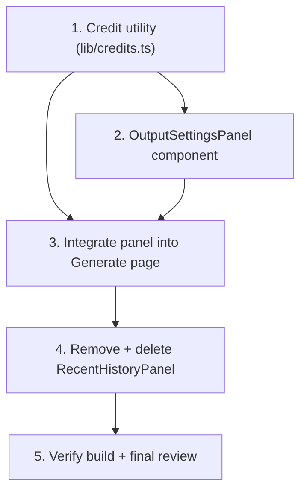

# Implementation Plan

## Overview

Frontend-only implementation of the Output Settings panel. Tasks proceed in dependency order: the pure credit utility first (independently testable), then the controlled panel component, then Generate-page integration, then removal of the obsolete Recent History panel, and finally build verification. No backend, route, or `useCredits()` changes are permitted by any task.

## Task Dependency Graph



```json
{
  "waves": [
    { "wave": 1, "tasks": ["1", "1.1"] },
    { "wave": 2, "tasks": ["2", "2.1"] },
    { "wave": 3, "tasks": ["3"] },
    { "wave": 4, "tasks": ["4"] },
    { "wave": 5, "tasks": ["5"] }
  ]
}
```

Wave 1: Task 1 + 1.1 (no deps). Wave 2: Task 2 + 2.1 (needs the utility types). Wave 3: Task 3 (needs utility + panel). Wave 4: Task 4 (needs page no longer importing the panel). Wave 5: Task 5 (final build/review).

## Tasks

- [ ] 1. Create the credit calculation utility in `lib/credits.ts`
  - Export type `OutputFormat = "png" | "jpg" | "3d"` and type `Resolution = "standard" | "hd"`.
  - Export the interface `CreditCalculationInput { variantCount: number; format: OutputFormat; resolution: Resolution }`.
  - Export constants `BASE_CREDITS = 10`, `FORMAT_3D_PREMIUM = 5`, `RESOLUTION_HD_PREMIUM = 3`.
  - Export pure function `calculateCredits({ variantCount, format, resolution })` returning `(BASE_CREDITS + formatPremium + resolutionPremium) * variantCount`, where formatPremium is 5 only for `"3d"` and resolutionPremium is 3 only for `"hd"`.
  - Keep the module free of React/DOM/I/O so a future backend can reuse it unchanged.
  - _Requirements: 4.1, 4.2, 4.3, 4.6_
  - _Properties: 1, 2, 3_

- [ ] 1.1 Add unit tests for `calculateCredits`
  - Cover the cost-model matrix: 1·PNG·Standard=10, 2·JPG·Standard=20, 1·3D·Standard=15, 1·PNG·HD=13, 1·3D·HD=18, 4·3D·HD=72.
  - Assert Property 1 (result ≥ 10 for variantCount ≥ 1), Property 2 (linear in variantCount), Property 3 (3D adds exactly 5×count, HD adds exactly 3×count).
  - If no test runner is configured, set up Vitest minimally for this module only; otherwise add to the existing runner. Do not touch unrelated config.
  - _Requirements: 4.1, 4.2, 4.3_
  - _Properties: 1, 2, 3_

- [ ] 2. Create the `OutputSettingsPanel` component (`components/generation/output-settings-panel.tsx`)
  - Implement as a fully controlled, stateless client component with props `variantCount`, `format`, `resolution`, `totalCredits`, `onVariantCountChange`, `onFormatChange`, `onResolutionChange` (import `OutputFormat`/`Resolution` from `lib/credits.ts`).
  - Root: `bg-white border border-[#E5E4E0] rounded-2xl p-5 h-full flex flex-col`. Header: `Sliders` icon (`w-4 h-4 text-[#F97316]`) + "Output Settings" (`text-lg font-bold text-[#1A1A1A]`), `mb-4`. Controls wrapper: `flex-1 space-y-5`.
  - Group A "Jumlah variasi": label (left) + hint "10 credits × jumlah" (right, `text-xs text-[#A3A3A3]`); `grid grid-cols-4 gap-2` buttons 1–4.
  - Group B "Format output": 3 stacked rows (`space-y-2`) with icon + label — "PNG transparan" (`ImageIcon`), "JPG flat" (`FileImage`), "3D mockup" (`Box`) with a right-aligned "+5" badge.
  - Group C "Resolusi": `grid grid-cols-2 gap-2` — "Standard" and "HD" (HD with a "+3" badge after the text).
  - Footer: `mt-auto pt-4 border-t border-[#E5E4E0]` row — "Total estimasi" (left, `text-sm text-[#737373]`) and `{totalCredits} credits` (right, `text-[#F97316] font-bold`).
  - Shared selector states: active = `border-2 border-[#F97316] bg-[#F97316]/10 text-[#F97316]`; default = `border border-[#E5E4E0] bg-white text-[#1A1A1A]`. Each group renders exactly one active option from its prop value and calls the matching `on*Change` on click.
  - Use only the approved palette and non-AI icons.
  - _Requirements: 1.1, 1.3, 1.4, 2.1, 2.3, 2.4, 3.1, 3.3, 3.4, 4.4, 6.2, 6.3, 6.4, 6.5_
  - _Properties: 5, 6_

- [ ] 2.1 Add component tests for `OutputSettingsPanel`
  - Render with controlled props and assert: exactly one active option per group; clicking each option invokes the correct `on*Change` with the expected value; footer renders the passed `totalCredits`; "+5" and "+3" badges and the "10 credits × jumlah" hint are present.
  - _Requirements: 1.1, 2.1, 2.3, 3.1, 3.3, 4.4_
  - _Properties: 5, 6_

- [ ] 3. Integrate the panel into the Generate page (`app/(user)/generate/page.tsx`)
  - Add state `variantCount` (default 1), `outputFormat` (default "png"), `resolution` (default "standard"); import and compute `totalCredits = calculateCredits({ variantCount, format: outputFormat, resolution })`.
  - Render `<OutputSettingsPanel ... />` in the right column (`lg:col-span-3`) wired to the state + handlers + `totalCredits`. Remove the `RecentHistoryPanel` import and usage.
  - Update `canGenerate` to gate on `balance >= totalCredits` (replace the literal `10`); keep the existing prompt-length and submitting conditions.
  - Update the Generate button: enabled label "Generate Design · {totalCredits} credits"; insufficient-balance branch still shows "Not enough credits"; helper text uses `totalCredits` (insufficient: "You need {totalCredits - balance} more credits to generate").
  - Change the header badge text "10 credits per generation" → "Starts at 10 credits per generation".
  - Do NOT change the FormData sent to `/api/generate`, the fetch call, `useCredits()`, or any server interaction.
  - _Requirements: 1.2, 1.5, 2.2, 2.5, 3.2, 3.5, 4.5, 5.1, 5.2, 5.3, 5.4, 5.5, 6.1, 7.1, 8.1, 8.3, 8.4, 8.5_
  - _Properties: 4, 5_

- [ ] 4. Remove and delete the obsolete Recent History panel
  - Confirm via a workspace search that no source file imports `recent-history-panel.tsx` / `RecentHistoryPanel` after Task 3.
  - Delete `components/generation/recent-history-panel.tsx`. Do not touch the `/history` page or navigation.
  - _Requirements: 8.1, 8.2_

- [ ] 5. Verify build and review against requirements
  - Run `getDiagnostics` on the three in-scope source files and `npm run build`; resolve any type/import errors introduced by the change.
  - Confirm no file under `app/api/`, no route handler, no server action, and `useCredits()` were modified, and that the `/api/generate` request body is unchanged.
  - Spot-check acceptance criteria: defaults (1 / png / standard), reactive total, button label/gate at the `balance === totalCredits` boundary, header badge text, and the active/default selector styling.
  - _Requirements: 8.3, 8.4, 8.5, 8.6_
  - _Properties: 1, 2, 3, 4, 5, 6_

## Notes

- **Backend is hard out-of-scope.** No task may modify any file under `app/api/`, any route handler, any server action, the `/api/generate` request body, or the `useCredits()` hook. The server keeps deducting a flat 10 credits.
- **Estimate vs. charge.** The panel's Total estimasi is an estimate/quote only; reconciling it with the server charge is explicitly deferred to a future PR (see design.md → Known Trade-offs / Future Work). No task here addresses billing reconciliation.
- **In-scope files (exhaustive):** create `lib/credits.ts` and `components/generation/output-settings-panel.tsx`; update `app/(user)/generate/page.tsx`; delete `components/generation/recent-history-panel.tsx`.
- **Test sub-tasks (1.1, 2.1)** are optional if no test runner exists; in that case `npm run build` (Task 5) is the minimum required gate per project rules.
- Use the existing palette and non-AI icons only; preserve the 4-5-3 grid split and leave the center column and Live Generation Flow untouched.
